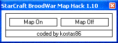



## StarCraft & SC Brood War Map Hack \(1\.10 only\)

### Description

This program show you how to use WriteProcessMemory & ReadProcessMemory api. With this program you can see the full map while playing starcraft (1.10 only) (it work's on b.net and offline). I didn't find a similar program here so i post it. Don't ask me how i find the offsets try www.gamehacking.com to learn how to hack games.
 
### More Info
 

             |
---                |---
**Submitted On**   |2003-11-19 14:47:24
**By**             |[Kostas86](https://github.com/Planet-Source-Code/PSCIndex/blob/master/ByAuthor/kostas86.md)
**Level**          |Intermediate
**User Rating**    |5.0 (10 globes from 2 users)
**Compatibility**  |VB 6\.0
**Category**       |[Windows API Call/ Explanation](https://github.com/Planet-Source-Code/PSCIndex/blob/master/ByCategory/windows-api-call-explanation__1-39.md)
**World**          |[Visual Basic](https://github.com/Planet-Source-Code/PSCIndex/blob/master/ByWorld/visual-basic.md)
**Archive File**   |[StarCraft\_16738311192003\.zip](https://github.com/Planet-Source-Code/kostas86-starcraft-sc-brood-war-map-hack-1-10-only__1-49988/archive/master.zip)

